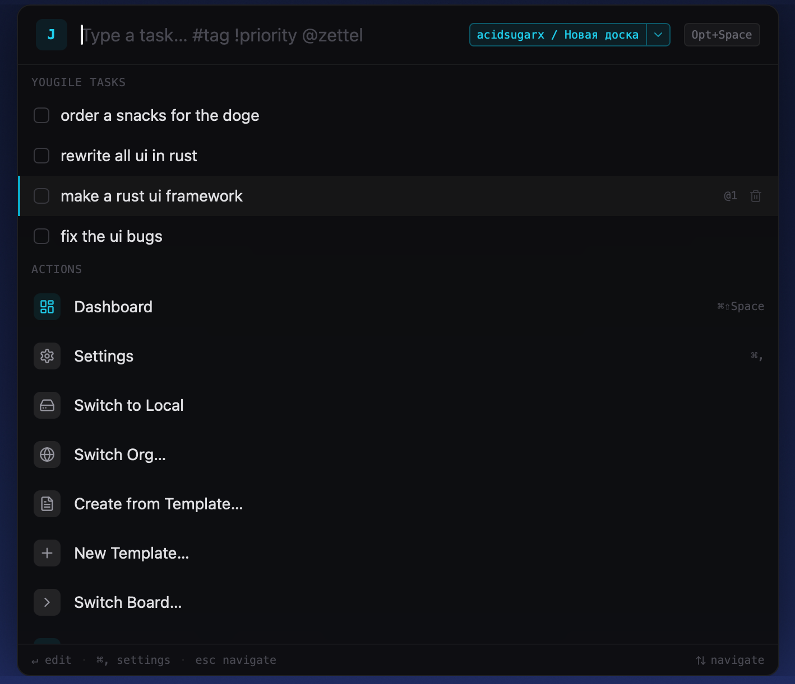
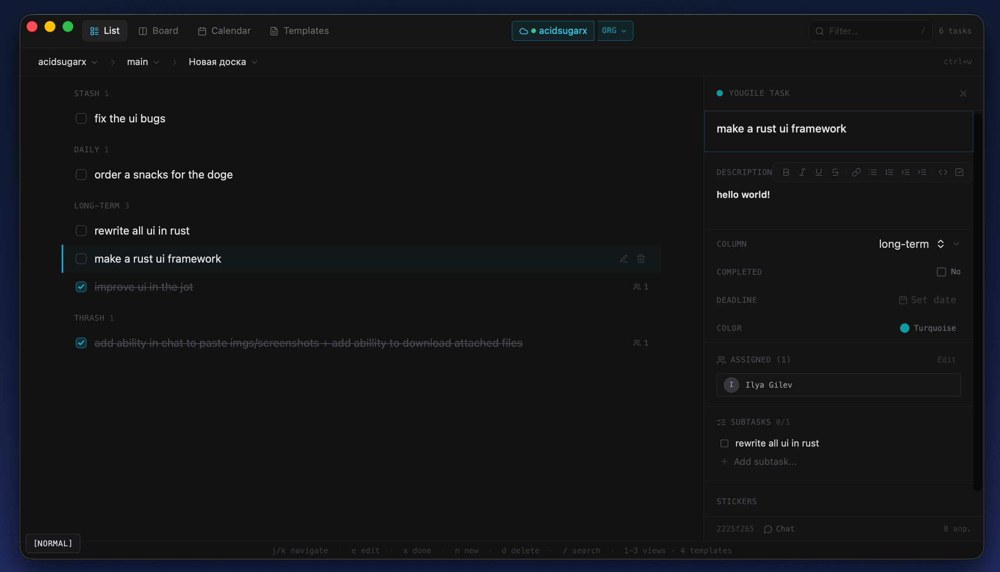
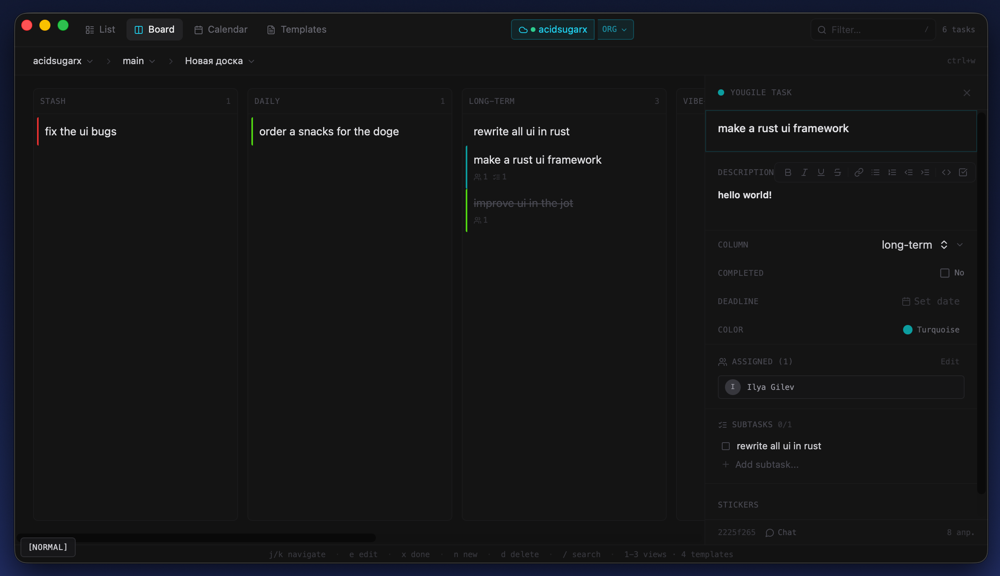

<div align="center">

# jot

**Capture thoughts before they escape.**

The keyboard-first task manager for people who think in keystrokes.

[](https://github.com/acidsugarx/jot/actions/workflows/ci.yml)
[](https://github.com/acidsugarx/jot/actions/workflows/release.yml)
[](LICENSE)

[Download for macOS](https://github.com/acidsugarx/jot/releases) · [Build from source](#install) · [Report a bug](https://github.com/acidsugarx/jot/issues)

</div>

---

<p align="center">
  
</p>

<p align="center">
  <code>Opt+Space</code> → type a thought → <code>Enter</code> → done.
</p>

---

## Your brain sends tasks faster than your mouse can keep up

jot lives in your menu bar and shows up when you need it — even over fullscreen apps. No windows to find, no buttons to click. Just type.

```
Follow up with Sarah about the API migration friday #work !high
```

That's it. Tag, priority, and due date — parsed from a single line. No forms, no modals, no context switch.

### Built for flow state

You're in a meeting. Someone mentions a deadline. `Opt+Space`, type it, back to the conversation. Two seconds.

You're deep in code and remember a bug. `Opt+Space`, capture it, back to the editor. Your flow never breaks.

You're in fullscreen mode. Doesn't matter — jot renders as a native overlay on top of everything.

---

## What it does

### One-line task capture with live parsing

Type naturally. jot understands:

| You type | What happens |
|----------|-------------|
| `#work` | Tagged as work |
| `!high` | High priority |
| `tomorrow`, `friday`, `next week` | Due date set |
| `@zettel` | Linked note created in your vault |

Syntax highlights appear as you type — you see exactly what jot understood before you press Enter.

### A real editor, not a toy

Press `e` on any task and get a full editor pane:

- **Rich-text descriptions** — Bold, italic, strikethrough, links, lists, code blocks, checkboxes. With keyboard shortcuts (`Ctrl+B`, `Ctrl+I`, `Ctrl+K`)
- **Checklists** — Nested items you can add, toggle, and reorder
- **Status, priority, due date** — Inline selectors, auto-save on every change
- **Tags** — Type to add, backspace to remove
- **Color labels** — Visual coding for quick scanning
- **Subtasks, assignees, chat, time tracking** — Full project management when connected to Yougile

Every field is keyboard-navigable. `j`/`k` between fields, `Enter` to activate, `i` to edit. Your hands never leave the keyboard.

### Three ways to see your work

`Cmd+Shift+Space` opens the dashboard:

<p align="center">
  
</p>

- **List view** — Dense, scannable rows. The default for a reason.
- **Kanban board** — Drag-and-drop columns. Add, rename, reorder.
- **Calendar view** — See what's due when.

<p align="center">
  
</p>

A sidebar gives you instant filters: inbox, today, by tag, by status. Press `Tab` to switch between local tasks and your Yougile boards.

### Vim everywhere

jot was designed for people who live in the terminal. Three modes, one philosophy: your keyboard does everything.

| Key | What it does |
|-----|-------------|
| `j` / `k` | Move up and down |
| `x` | Toggle done |
| `e` | Edit |
| `d` | Delete (press twice to confirm) |
| `s` | Cycle status |
| `m` | Move to next column |
| `:` | Command mode |
| `Esc` | Always goes back |

The mode indicator tells you where you are. Escape always gets you out. It's predictable and it's fast.

### Connects to your tools

**Obsidian** — Add `@zettel` to any task and jot creates a timestamped markdown note in your vault with YAML frontmatter and a back-link. Click the note icon to open it.

**Yougile** — Full two-way sync with your [Yougile](https://yougile.com) workspace. Multiple accounts, project/board navigation, real-time polling, file uploads, task chat. Manage team tasks without leaving jot.

### Task templates

Create reusable templates with pre-filled title, description, status, priority, and tags. Select one from the capture bar to pre-fill a new task. Build your own workflow.

### Respects your system

Dark mode with a brutalist zinc palette and cyan accents. Light mode with clean contrast and proper visibility everywhere. jot follows your system setting — no toggles needed.

### Your data, your machine

Local SQLite database. No account required. No cloud. No network latency. Yougile sync is optional and additive — your local tasks are always yours.

---

## Install

### macOS (Homebrew)

```bash
brew tap acidsugarx/tap
brew install --cask jot
```

### macOS / Linux (Download)

Grab the latest release from [github.com/acidsugarx/jot/releases](https://github.com/acidsugarx/jot/releases):

- **macOS** — `.dmg` (Apple Silicon)
- **Linux** — `.AppImage`

### Build from source

```bash
git clone https://github.com/acidsugarx/jot.git
cd jot
npm install
npm run tauri build
```

Requires Node.js 20+, Rust 1.77.2+, and [Tauri prerequisites](https://v2.tauri.app/start/prerequisites/).

---

## Keyboard shortcuts

### Global

| Shortcut | Action |
|----------|--------|
| `Opt+Space` | Open capture bar |
| `Cmd+Shift+Space` | Open dashboard |

### Capture bar

| Key | Action |
|-----|--------|
| `Enter` | Create task |
| `Esc` | Dismiss |
| `j` / `k` | Navigate |
| `e` | Edit task |
| `x` | Toggle done |
| `d` | Delete |
| `s` | Cycle status |
| `m` | Move column |
| `:` | Command mode |

### Dashboard

| Key | Action |
|-----|--------|
| `j` / `k` | Navigate tasks |
| `h` / `l` | Switch panes |
| `e` | Edit |
| `x` | Toggle done |
| `Tab` | Switch source |
| `/` | Search |
| `Esc` | Close editor |

### Rich-text editor

| Shortcut | Action |
|----------|--------|
| `Ctrl+B` | Bold |
| `Ctrl+I` | Italic |
| `Ctrl+K` | Insert link |
| `Ctrl+Shift+S` | Strikethrough |
| `Ctrl+Shift+C` | Checkbox |

---

## Contributing

Bug reports and pull requests are welcome at [acidsugarx/jot](https://github.com/acidsugarx/jot).

Run `make ci` before submitting — it checks formatting, types, lint, and tests across both Rust and TypeScript.

## License

MIT License &copy; 2026 [Ilya Gilev](https://github.com/acidsugarx)
